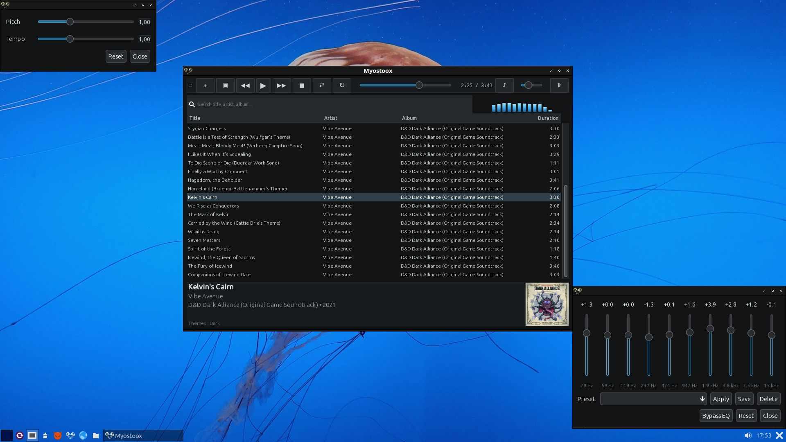
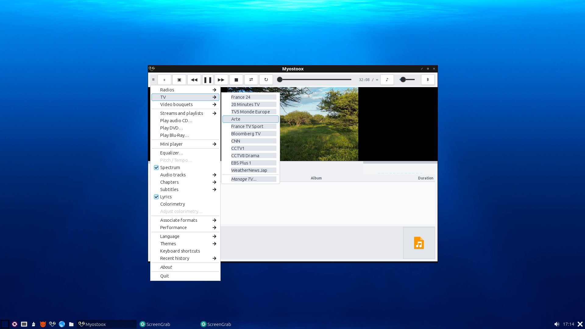
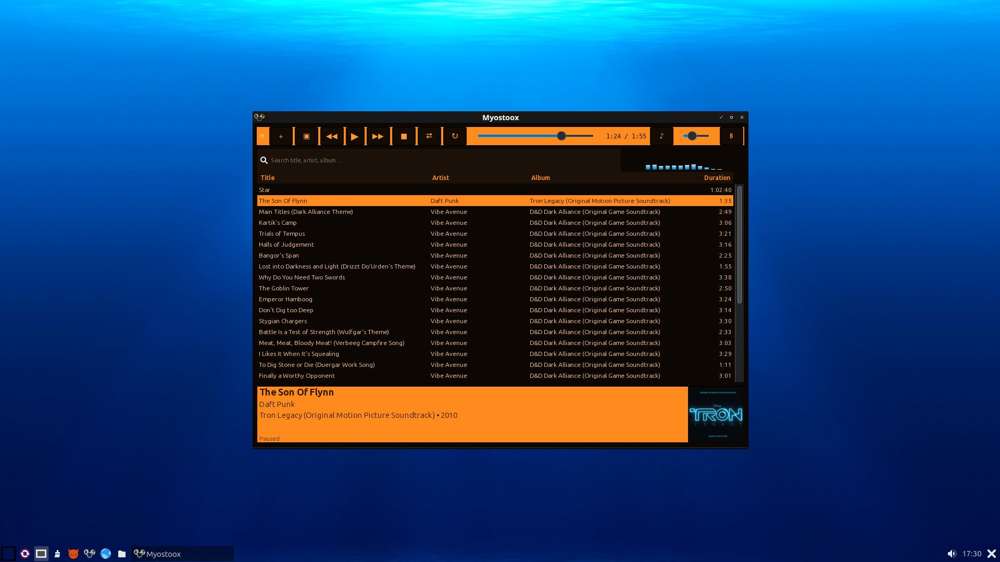
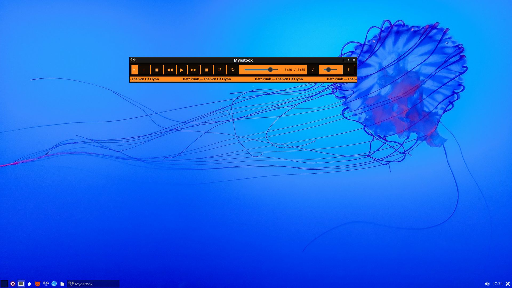
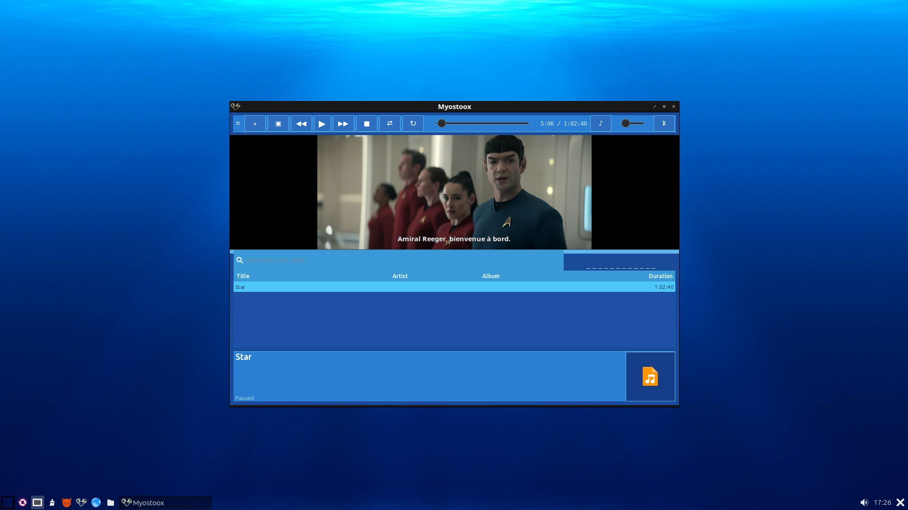
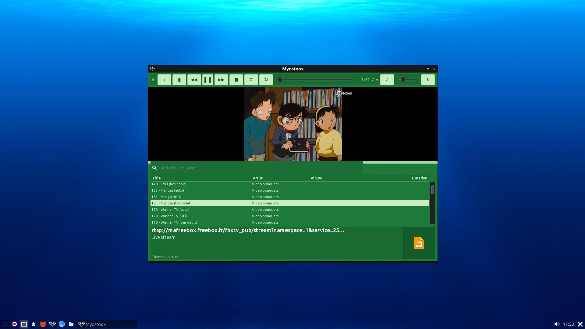
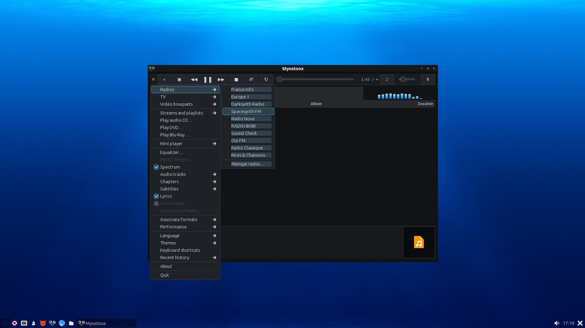
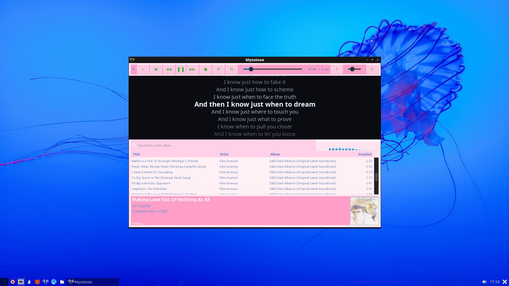
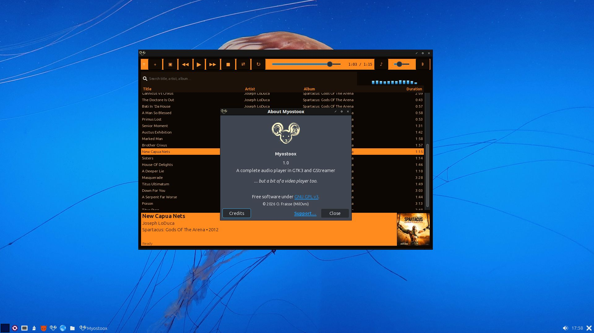

<p align="center">
  
</p>


# Myostoox

Audio/video player for **Lubuntu 26.04 LTS (Resolute Raccoon)** (and other Linux GTK desktops – LXQt / XFCE), written in Python 3 + GTK3 + GStreamer.

Main features: playlist, radios, TV / M3U bouquets, CD / DVD / Blu-ray (experimental), equalizer, pitch/tempo, spectrum, subtitles, lyrics (LRC), themes, MPRIS2, mini-player.

## Captures d'écran

<p align="center">
  
</p>

<p align="center">
  
</p>

<p align="center">
  
</p>

<p align="center">
  
</p>

<p align="center">
  
</p>


---

## Dependencies

### Required

```bash
sudo apt update && sudo apt install -y \
  python3 python3-gi python3-gi-cairo python3-cairo \
  gir1.2-gtk-3.0 gir1.2-gst-plugins-base-1.0 gir1.2-gstreamer-1.0 \
  gir1.2-gdkpixbuf-2.0 gir1.2-pango-1.0 gir1.2-notify-0.7 \
  gstreamer1.0-tools \
  gstreamer1.0-plugins-base \
  gstreamer1.0-plugins-good \
  gstreamer1.0-plugins-bad \
  gstreamer1.0-plugins-ugly \
  gstreamer1.0-libav \
  gstreamer1.0-gl \
  gstreamer1.0-x \
  gstreamer1.0-alsa \
  gstreamer1.0-pulseaudio \
  gstreamer1.0-gtk3 \
  gstreamer1.0-vaapi \
  python3-mutagen \
  libnotify4 \
  libdvd-pkg libdvdread8t64 libdvdnav4 libbluray2 \
  ubuntu-restricted-extras
```

### Strongly recommended (Lubuntu / XFCE)

```bash
# Audio CD
sudo apt install libcdio-dev libcdio-paranoia2

# Encrypted CSS DVDs
sudo dpkg-reconfigure libdvd-pkg

# For Intel GPUs
sudo apt install -y mesa-va-drivers vainfo

# For proper NVIDIA decoding
sudo ubuntu-drivers autoinstall
```

### Optional

```bash
# DVD / Blu-ray (depending on local legality and firmwares)
libaacs0 + KEYDB.cfg (commercial Blu-rays)
```

---

## Launching

```bash
python3 Myostoox.py
# or
chmod +x Myostoox.py
./Myostoox.py
```

Files passed as arguments (Thunar, double-click) are sent to the already running instance if one exists.

Configuration: `~/.config/Myostoox/` (playlist, state, radios, themes…).


<p align="center">
  
</p>


---

## Menu — useful new features

| Entry | Purpose |
|-------|---------|
| **Import / Export playlist…** | `.m3u` / `.m3u8` / `.pls` files |
| **Mini-player** | Transport bar only, always on top & optional scrolling title |
| **Lyrics** | Displays `.lrc` / `.txt` / tags (audio only) |

- **Missing file**: absent tracks (unplugged USB) appear in *italics* with ⚠.
- **Screen blanking**: automatically inhibited during **video playback** (via `org.freedesktop.ScreenSaver`).
- **Notifications**: title / artist on every track change (if `libnotify` is installed).

---

## Quick troubleshooting

| Symptom | Hint |
|---------|------|
| No sound / unknown format | Install `gstreamer1.0-plugins-ugly` and `gstreamer1.0-libav` |
| Silent or crashing MKV E-AC3 | The internal custom MKV pipeline handles this case; check `gstreamer1.0-libav` |
| No notifications | `sudo apt install gir1.2-notify-0.7` |
| CD not detected | `libcdio` + ugly plugins; make sure it is a real audio CD (not data) |
| Screen turns off during a movie | Check that the session exposes the ScreenSaver D-Bus interface (XFCE does) |

---

## License / usage

This project is free software distributed under the **GNU General Public License version 3** (GPL-3.0).

See the [`LICENSE`](LICENSE) file for the full text.

Use in accordance with local laws (DVD/Blu-ray, stream sources).

---

## Screen blanking / sleep under LXQt

Myostoox tries to inhibit screen blanking during **video playback** via D-Bus  
(`org.freedesktop.ScreenSaver`, then `org.freedesktop.PowerManagement.Inhibit`).

Under **LXQt** (Lubuntu), these services are often missing: this is not a playback bug.  
To prevent the screen from turning off during a movie:

1. **Settings → Power Management (LXQt)** (`lxqt-config-powermanagement`)
2. Extend or disable screen blanking / sleep
3. Optional: install a D-Bus-compatible screensaver provider

`ServiceUnknown` messages related to ScreenSaver / Notifications are silently ignored.

---

## Author

O. FRAISSE (MilOvni)

<p align="center">
  
</p>

<p align="center">
  
</p>

<p align="center">
  
</p>

<p align="center">
  
</p>


```
